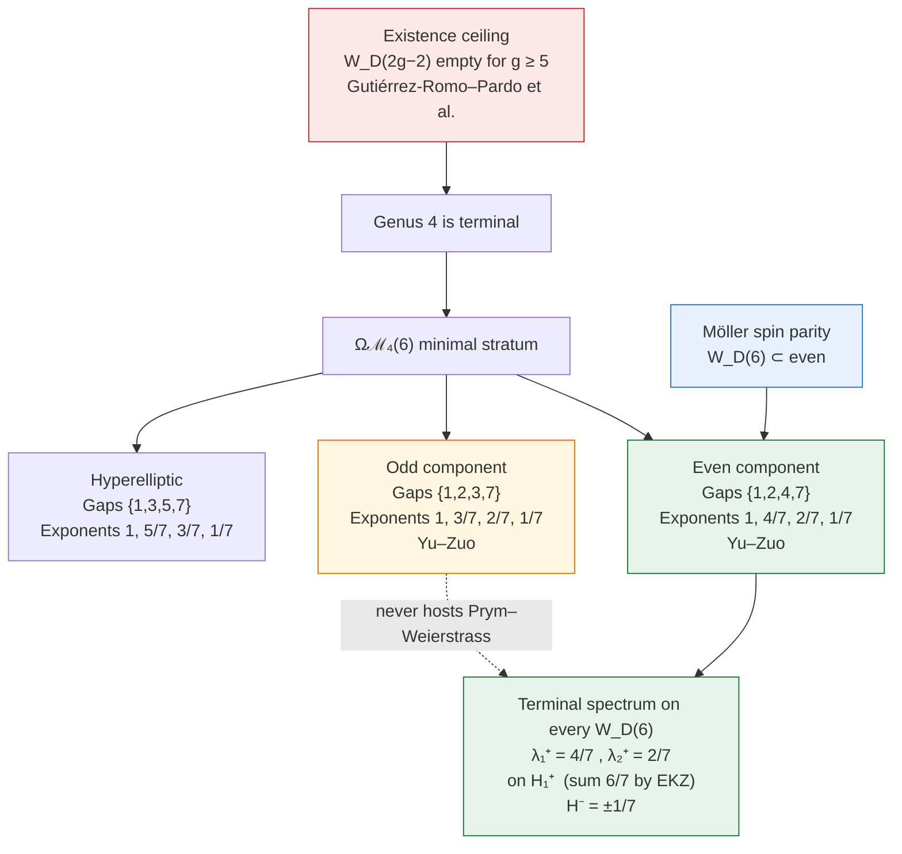

# Terminal Spectrum — Visual Aid

## One-line summary

Genus 4 is the last non-empty case of Weierstrass Prym eigenforms.  
All of them sit in the **even** component of $H(6)$.  
Yu–Zuo’s filtration then forces $\lambda_1^+=4/7$, $\lambda_2^+=2/7$ for every discriminant $D$.

## Attribution strip

| Piece | Source |
|-------|--------|
| Emptiness $g\ge 5$ | Gutiérrez-Romo–Pardo et al. |
| Even spin of $W_D(6)$ | Möller |
| Filtration / exponents | Yu–Zuo (arXiv:1203.6053) |
| Sum $6/7$, $H^-=\pm 1/7$ | EKZ / Möller |

This scaffold claims no discovery.
